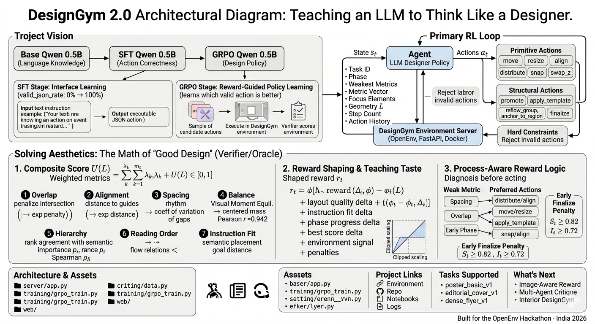
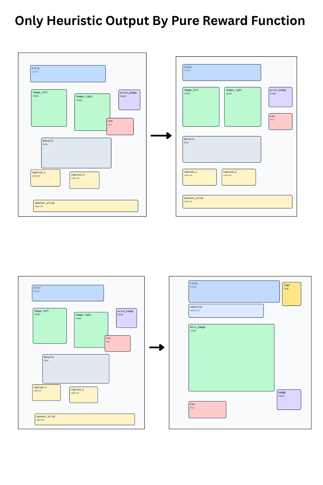
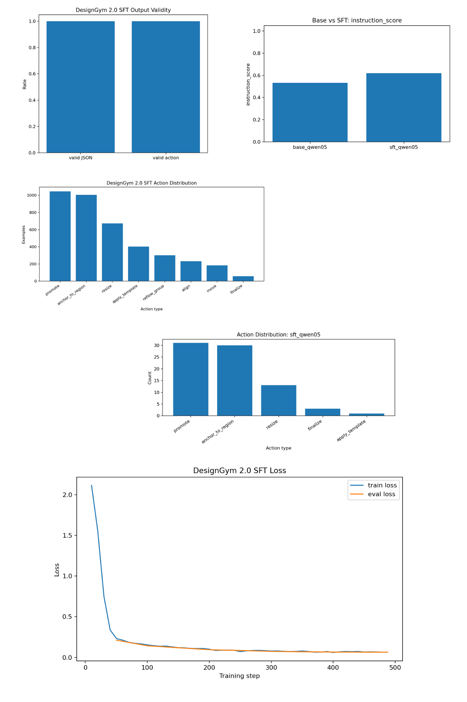
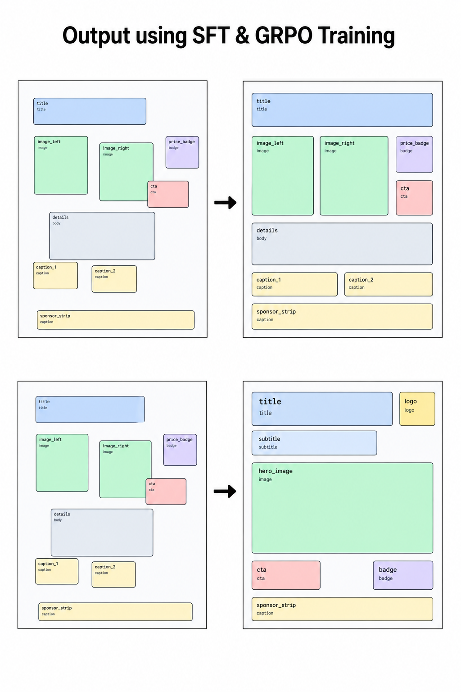

# 🎨 DesignGym 2.0 — Teaching an LLM to Think Like a Designer

> *What if a machine didn't just generate a layout — but learned how to improve one?*

---

## The Big Idea

Imagine a blank canvas. On it, you can place anything — a headline, a hero image, a call-to-action, a sofa, a warehouse shelf, a hospital bed, a circuit component. **The problem of arrangement is universal.**

DesignGym 2.0 asks a radical question:

**Can we train an LLM to reason about space — iteratively, purposefully, the way a designer does?**

Not a one-shot generator. Not a template-picker. An *agent* that looks at a layout, diagnoses what's wrong, chooses a meaningful edit, and gets better over time through feedback.

That's what this project is. And it's bigger than posters.


*Figure 1 — End-to-end architecture: the OpenEnv-compliant DesignGym environment, the heuristic planner that bootstraps SFT data, the SFT adapter that locks in the action interface, and the GRPO trainer that learns design preference from verifiable reward.*

---

## 🌐 The Vision: A Canvas Is a Universal Problem

Here's what hit me building this: **graphic design is just one instance of a much deeper problem.**

Every time humans arrange objects under constraints to serve a goal, they are solving a layout problem:

- 🛋️ **Interior Design** — furniture in a room, flow, light, balance
- 🏭 **Warehouse Planning** — shelf placement, picking efficiency, safety zones
- 🏥 **Hospital Floor Plans** — patient flow, emergency access, quiet zones
- 💻 **UI Dashboards** — information hierarchy, click efficiency, accessibility
- 🖥️ **Chip Placement (VLSI)** — routing, thermal zones (a billion-dollar optimization problem)
- 🏫 **Classroom Seating** — learning groups, teacher sightlines, collaborative zones
- 🏪 **Retail Layouts** — foot traffic, product discovery, impulse zones
- 📰 **Editorial Design** — reading order, visual weight, column balance
- 🏙️ **Urban Zoning** — density, transit access, green space allocation

The abstract structure is always the same:

$$\text{objects} + \text{constraints} + \text{goals} \rightarrow \text{optimized arrangement}$$

DesignGym proves this framework works for graphic design. The architecture is a foundation for **any domain where arrangement matters**.

---

## 🔗 Project Links

| Resource | Link |
|---|---|
| 🌍 **Environment (HF Space)** | [DesignGym Environment Server](https://huggingface.co/spaces/yashvyasop/DesignGym) |
| 💻 **GitHub Repo** | [canboyedits/DesignGym](https://github.com/canboyedits/DesignGym) |
| 🧠 **SFT Trained Adapter** | [designgym2-sft-qwen05-lora](https://huggingface.co/yashvyasop/designgym2-sft-qwen05-lora) |
| 📓 **GRPO Training Notebook** | [grpo_train_colab.ipynb](https://colab.research.google.com/drive/1jw1waO-bc0Mk3U7-RBbomsIGFBWvA0aW?usp=sharing) |
| 📓 **SFT Training Notebook** | [SFT_training_script.ipynb](https://colab.research.google.com/drive/1ZtjQSen19Sdmx8FOXvM-nb_AFDSNM_1C?usp=sharing) |
| 📓 **Evaluation Notebook** | [evaluate_base_vs_sft.ipynb](https://colab.research.google.com/drive/1U1t9GVkc8sk2BeYCxoDnlHV1WMjYCpv1?usp=sharing) |
| 📊 **Training Logs** | [HF Training Job](https://huggingface.co/jobs/yashvyasop/69ed7b02d70108f37acdf597) |

---

## 🤔 Why Not Just Generate the Layout?

Because that's not how it works in the real world.

A good designer doesn't conjure the final poster from thin air. They start somewhere, step back, ask *"what's wrong here?"*, make a targeted edit, look again, and repeat. The process is:

```
bad layout → structural choice → placement → refinement → polish → final design
```

DesignGym 2.0 formalizes that process as a **reinforcement learning environment**. The agent learns the *workflow of design*, not just the output.

This matters because layout improvement is an **optimization problem**, not a generation problem. And RL is the right tool for optimization.

---

## 🔬 Round 1 → Round 2: What Changed?

| Area | DesignGym Round 1 | DesignGym 2.0 |
|---|---|---|
| Core goal | Optimize layouts with structured actions | Learn the *process* of design over multiple phases |
| Task style | Short-horizon layout refinement | Long-horizon planning + instruction following |
| Agent behavior | Local edit selection | Structure → placement → refinement → polish |
| Reward | Geometry + aesthetic deltas | Delta-aware, instruction-aware, phase-aware |
| Learning | Environment-ready foundation | SFT + GRPO training pipeline |
| Evaluation | Layout quality + validity | Base vs heuristic vs SFT vs GRPO comparison |

Round 1 answered: *Can layout design be a real RL environment?*

Round 2 answers: *Can an LLM learn to act like a designer?*

---

## 🧩 The Environment: How It Works

### State

Each design is a canvas of normalized elements. Every element $b_i$ has geometry:

$$b_i = (x_i,\; y_i,\; w_i,\; h_i), \quad \text{where all values} \in [0,1]$$

A layout is:

$$L = \{b_1, b_2, \dots, b_n\}$$

The state given to the agent includes: task ID, step count, current score, best score so far, instruction score, phase score, metric vector, weakest metrics, focus elements, action history, full geometry, and current phase. The agent can reason not just about *what* the layout looks like but *where it is* in the design process.

The RL loop:

$$s_t \;\xrightarrow{\;a_t\;}\; s_{t+1},\; r_t$$

### Actions

The action space spans both pixel-level and structural edits — because real design isn't just moving boxes:

**Primitive actions:** `move`, `resize`, `align`, `distribute`, `snap`, `swap_z`

**Structural actions:** `apply_template`, `promote`, `reflow_group`, `anchor_to_region`, `finalize`

For example:
- *"Make the title louder"* → `promote`
- *"Clean up the spacing"* → `distribute` or `reflow_group`
- *"Move the CTA to the footer"* → `anchor_to_region`
- *"Choose a stronger layout"* → `apply_template`

### Hard Constraints

The feasible layout space is:

$$\mathcal{F} = \{L \mid L \text{ satisfies margin, size, ratio, and region constraints}\}$$

Only $L \in \mathcal{F}$ are accepted. Invalid actions are rejected — forcing the agent to learn *legal creativity*.

---

## 🎯 Solving Aesthetics: The Math of "Good Design"

This is where DesignGym gets serious. Rather than asking *"does it look good?"* (subjective), we ask *"what makes it measurably good?"* (computable).

My research into computational aesthetics — from Birkhoff's 1933 aesthetic measure $M = O/C$ to modern Visual Moment Equilibrium models — confirmed that most design quality signals are **mathematically expressible**. DesignGym implements seven of them:

### The Composite Score

$$U(L) = \sum_{k=1}^{K} \lambda_k \, g_k(L), \quad g_k(L) \in [0,1],\; \sum_k \lambda_k = 1$$

Each $g_k$ is an independent, interpretable aesthetic signal. Together they give a holistic quality score $U(L) \in [0,1]$.

---

### 1. Overlap — *Do elements collide?*

$$g_{\text{overlap}}(L) = \exp\!\left(-\frac{\sum_{i<j} \mathrm{I}(b_i,b_j)}{\sum_i a_i + \epsilon}\right), \quad a_i = w_i h_i$$

Exponential penalty for any intersection. Clean layouts score near 1.

---

### 2. Alignment — *Do things line up intentionally?*

$$g_{\text{align}}(L) = \frac{1}{|\mathcal{Q}|} \sum_{q \in \mathcal{Q}} \exp\!\left(-\frac{d_q}{\tau_{\text{align}}}\right)$$

$d_q$ is the distance from element anchors (left, center, right edges) to the nearest alignment guide. Lower distance → higher score.

---

### 3. Spacing — *Is the rhythm intentional?*

Coefficient of variation on gaps $\Delta$:

$$\mathrm{CV}(\Delta) = \frac{\sigma(\Delta)}{\mu(\Delta) + \epsilon}, \qquad g_{\text{spacing}}(L) = \exp\!\left(-\frac{\mathrm{CV}(\Delta)}{\tau_{\text{space}}}\right)$$

Low variation = consistent rhythm = high score. This captures the difference between *accidental spacing* and *deliberate structure*.

---

### 4. Balance — *Does visual weight feel stable?*

Each element carries visual mass $m_i = a_i \cdot p_i$ (area × semantic importance). The center of mass:

$$c_x = \frac{\sum_i m_i x_i^{(c)}}{\sum_i m_i}, \qquad c_y = \frac{\sum_i m_i y_i^{(c)}}{\sum_i m_i}$$

Balance rewards layouts centered around the canvas midpoint:

$$g_{\text{balance}}(L) = \exp\!\left(-\frac{\sqrt{(c_x - 0.5)^2 + (c_y - 0.5)^2}}{\tau_{\text{bal}}}\right)$$

Inspired by the **Visual Moment Equilibrium** model — treating layout as a physics problem where visual torques must cancel. This achieves Pearson $r = 0.942$ correlation with human perception benchmarks.

---

### 5. Hierarchy — *Do big things matter more?*

Visual salience per element:

$$\zeta_i = \alpha \log(a_i + \epsilon) - \beta y_i + \gamma f_i + \delta z_i$$

Hierarchy is measured by rank agreement with semantic importance $p_i$ via Spearman correlation:

$$g_{\text{hier}}(L) = \frac{1 + \rho_S(p,\, \zeta)}{2}$$

If the biggest element is also the most important, the layout *looks* right because it *is* right.

---

### 6. Reading Order — *Does the eye flow correctly?*

Given required reading relations $\mathcal{R} = \{(i,j)\}$:

$$g_{\text{read}}(L) = \frac{1}{|\mathcal{R}|} \sum_{(i,j)\in\mathcal{R}} \mathbf{1}\{i \prec j\}$$

$i \prec j$ means element $i$ appears before $j$ in the intended scan path (F-pattern, Z-pattern, etc.).

---

### 7. Instruction Fit — *Does the layout follow the brief?*

Tasks have semantic placement goals (CTA in lower-right, masthead at top, etc.). Given target region center $r_i$ and element center $c_i$:

$$g_{\text{intent}}(L) = \frac{1}{n} \sum_i \exp\!\left(-\frac{\|c_i - r_i\|}{\tau_{\text{intent}}}\right)$$

This is the bridge from pure geometry to *design intention* — an element can be perfectly aligned yet still be in the wrong place.

---

## 🏆 The Reward Function: Teaching Taste

This is the most important design decision in the whole project. **A flat reward teaches nothing.**

After SFT, nearly every action is valid JSON — so rewarding "valid JSON" gives GRPO a flat signal with no learning gradient. The reward had to be richer, more informative, and process-aware.

### Delta-Sensitive Shaping

Let $S_t$, $I_t$, $P_t$, $B_t$ be layout score, instruction score, phase score, and best-so-far score at step $t$:

$$\Delta S_t = S_t - S_{t-1}, \qquad \Delta I_t = I_t - I_{t-1}, \qquad \Delta B_t = \max(0,\, B_t - B_{t-1})$$

With a clipped scaling function that makes small improvements legible:

$$\phi(\Delta, \tau) = \mathrm{clip}\!\left(\frac{\Delta}{\tau},\; -1,\; 1\right)$$

The full shaped reward:

$$r_t = \mathrm{clip}\!\Big(\underbrace{0.03}_{\text{base}} + \underbrace{0.35\,\phi(\Delta S_t,\; 0.015)}_{\text{layout quality}} + \underbrace{0.35\,\phi(\Delta I_t,\; 0.020)}_{\text{instruction fit}} + \underbrace{0.15\,\phi(\Delta P_t,\; 0.025)}_{\text{phase progress}} + \underbrace{0.10\,\phi(\Delta B_t,\; 0.015)}_{\text{best score}} + \underbrace{0.05\,r_{\text{env}}}_{\text{env signal}} + b_{\text{process}} - \pi_t,\; -1,\; 1\Big)$$

Where $b_{\text{process}}$ is a phase-aware bonus and $\pi_t$ is a penalty for invalid, useless, or premature actions.

### Process-Aware Reward: Diagnosing Before Acting

The reward checks not just *whether* the layout improved, but *whether the agent chose the right kind of action for the current weakness*:

| Weak Metric | Preferred Actions |
|---|---|
| Overlap / crowding | `move`, `resize`, `reflow_group` |
| Spacing / rhythm | `distribute`, `align`, `reflow_group` |
| Hierarchy | `promote`, `resize`, `apply_template` |
| Instruction fit | `anchor_to_region`, `promote` |
| Early structure phase | `apply_template` |
| Late polish phase | `align`, `snap`, `finalize` |

This teaches the agent to *diagnose → choose relevantly → improve* — not just make random valid edits.

### Early Finalize Penalty

The agent must not give up early. `finalize` is only rewarded if:

$$S_t \geq 0.82 \quad \text{and} \quad I_t \geq 0.72$$

Otherwise $\pi_{\text{finalize}} > 0$. This enforces long-horizon behavior and prevents the agent from prematurely declaring victory.

---

## 🎓 Training Pipeline: From Language to Design Policy

```
Base Model  →  Heuristic Planner  →  SFT Model  →  GRPO Model
```


*Figure 2 — The heuristic planner solving an episode end-to-end. It diagnoses the weakest metric, picks a phase-appropriate action, applies it, and re-scores — generating the (state → action) pairs we use as SFT training data. This is how the agent gets a warm start without human labels.*

### Why SFT First?

The base model (Qwen 0.5B) understands design language but cannot speak the *environment's action format*. It says things like:

> *"Move the title higher and make the CTA stronger."*

Semantically meaningful — but not executable. The environment needs:

```json
{
  "action_type": "anchor_to_region",
  "element_id": "cta",
  "region": "lower_right"
}
```

**SFT teaches the model the interface.** The goal is not creativity — it's action correctness.

Result: `valid_json_rate: 0%` → `valid_json_rate: 100%`. That's not a fine-tune. That's a capability phase transition.


*Figure 3 — SFT training evidence on Qwen-0.5B: loss converges cleanly, validity rates jump to 100%, and the action distribution learned by the model mirrors the heuristic teacher. After SFT the model can act in DesignGym; before SFT it cannot.*

### Why GRPO After?

Once the model can act, GRPO teaches it *which valid action is better*.

GRPO uses environment reward directly — no static labels, no human annotation on every trajectory. The loop:

1. Sample multiple candidate actions
2. Execute them in DesignGym
3. Score each with the verifier
4. Increase probability of higher-reward actions
5. Decrease probability of lower-reward actions

This works because DesignGym has **verifiable rewards** — the environment is the oracle. No reward model needed.

The learning story:

$$\text{Language Model} \;\xrightarrow{\;\text{SFT}\;}\; \text{Action Model} \;\xrightarrow{\;\text{GRPO}\;}\; \text{Design Policy}$$

---

## 📊 Results: Evidence of Learning

| Policy | Final Score | Instruction Score | Valid JSON | Early Finalize |
|---|---|---|---|---|
| **Base** Qwen 0.5B | 0.6948 | 0.5360 | **0%** | 100% |
| **SFT** Qwen 0.5B | 0.7101 | 0.6263 | 100% | 0% |
| **SFT @ Best-of-4** | 0.7057 | 0.6672 | 100% | 0% |
| **GRPO** Qwen 0.5B | 0.6717 | 0.5483 | 98% | 67% |
| **GRPO @ Best-of-4** ★ | 0.6781 | **0.5817** | **100%** | **17%** |

★ = shipped headline configuration. Base→Final pipeline gain on instruction score: **+8.5%**, on valid JSON: **0% → 100%**, on premature finalizes: **down 83%**.

The most important result is the jump from **0% to 100% valid actions**. That's the model crossing from "knows about design" to "can act in a design environment."

GRPO then learns *which* valid actions are better — a harder problem that continues to improve with more training. The infrastructure and reward signal are proven.



---

## 🛠️ Tasks Supported

**`poster_basic_v1`** — Headline hierarchy, hero image placement, CTA placement, clean spacing, reading order.

**`editorial_cover_v1`** — Masthead preservation, headline stack, visual balance, editorial hierarchy.

**`dense_flyer_v1`** — Crowded layout repair, support group reflow, spacing under density, caption alignment.

Three very different design problems. A model that improves across all three has learned *general layout reasoning*, not template memorization.

---

## 🔮 How Big Can This Get?

The framework underlying DesignGym isn't about posters. It's about this general structure:

$$U(L) = \lambda_1\, g_{\text{efficiency}} + \lambda_2\, g_{\text{safety}} + \lambda_3\, g_{\text{accessibility}} + \lambda_4\, g_{\text{aesthetic}}$$

Swap the metrics. Swap the domain. The agent still learns to optimize arrangement through sequential decision-making.

**Interior Design:** `empty room → zoning → furniture placement → spacing → style polish`

**VLSI Chip Placement:** `component placement → routing → thermal zones → signal integrity`

**Warehouse Logistics:** `shelf placement → picking paths → safety zones → density optimization`

**Hospital Layout:** `patient flow → emergency access → staff circulation → quiet zones`

**UI Design:** `information hierarchy → click paths → accessibility → responsive stability`

The same RL loop. A different reward function. **The canvas is always the problem, and the canvas is everywhere.**

---

## 🏗️ Architecture

```
.
├── client.py                      # OpenEnv client interface
├── inference.py                   # Policy inference runner
├── models.py                      # Typed action/observation models
├── notebooks/
│   ├── grpo_train_colab.ipynb    # GRPO training ← start here
│   ├── SFT_training_script.ipynb # SFT training
│   └── evaluate_base_vs_sft_designgym2.ipynb
├── training/
│   ├── grpo_train.py              # GRPO training script
│   ├── generate_sft_data.py       # SFT data generation
│   └── run_grpo.sh                # Smoke test runner
├── server/
│   ├── app.py                     # FastAPI wrapper
│   ├── DesignGym_environment.py   # Core environment logic
│   ├── rewards.py                 # Reward functions
│   ├── phases.py                  # Phase-aware logic
│   └── requirements.txt
├── data/sft/                      # SFT train/eval data
├── assets/                        # Plots and diagrams
├── web/                           # Demo web UI
├── Dockerfile
├── pyproject.toml
├── openenv.yaml                   # OpenEnv manifest
└── README.md
```

---

## ⚡ OpenEnv Compatibility

DesignGym is fully OpenEnv-compatible: `reset()`, `step(action)`, typed models, FastAPI server, Docker + HF Space deployment, deterministic seeded episodes.

---

## 🚀 Running It

**Install:**
```bash
pip install -e .
openenv validate
python server/app.py
```

**Docker:**
```bash
docker build -t designgym-env .
docker run --rm -p 8000:8000 designgym-env
```

**Inference:**
```bash
HF_TOKEN=your_token \
API_BASE_URL=https://router.huggingface.co/v1 \
MODEL_NAME=meta-llama/Llama-3.1-8B-Instruct:scaleway \
DESIGNGYM_TASK=poster_basic_v1 \
python inference.py
```

---

## 🧪 What's Next

- **Image-Aware Reward** — Saliency maps, OCR regions, protected focal zones
- **Preference-Trained Reward Model** — Learn from human pairwise layout comparisons
- **Style-Conditioned Design** — Luxury, editorial, minimal, corporate as goal inputs
- **Interior DesignGym** — Same framework extended to room/furniture layout
- **Multi-Agent Critique** — Designer agent proposes → Critic agent diagnoses → Designer improves
- **Multi-Page Layout** — Magazines, slide decks, reports, product catalogs

---

## 💡 The Bottom Line

Design is usually treated as subjective and unteachable by machine.

DesignGym proves that's not true. Many aspects of layout quality are **computable, verifiable, and learnable**. And because the underlying framework is general, the same approach extends to any domain where arrangement matters.

The final vision: models that don't just generate designs — but **learn how to improve them**, step by step, the way a skilled designer does.

> A good designer does not just produce a layout.  
> A good designer repeatedly diagnoses, edits, compares, and improves.  
>  
> **DesignGym 2.0 teaches that process to a machine.**

---

*Built for the OpenEnv Hackathon · India 2026*  
*Math rendered with [KaTeX](https://katex.org/) / [MathJax](https://www.mathjax.org/)*