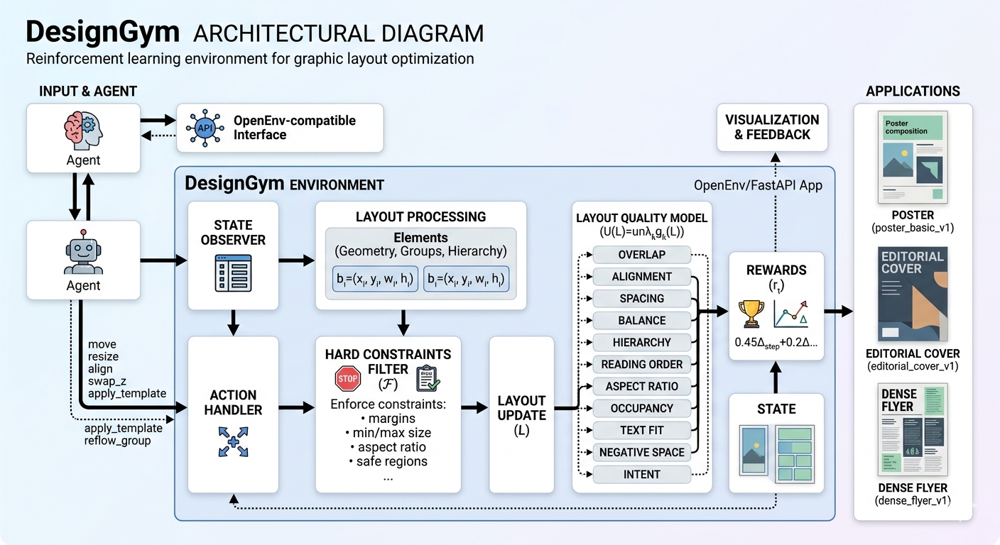

# DesignGym

DesignGym is an **OpenEnv-compatible reinforcement learning environment for graphic layout optimization**.  
It is designed for **poster, editorial cover, and dense flyer** style layouts, where an agent must iteratively improve a composition by editing element geometry, grouping, hierarchy, reading order, and semantic placement.

The environment is built for the hackathon requirement of **real-world, graded, reproducible environments** and focuses on a hard but practical problem:

> many layouts can be valid, but strong layouts must also be **readable, balanced, structured, and human-pleasing**.

---



## 1. Motivation

Design tasks are not solved by one rigid template.  
A good poster or magazine cover must balance:

- visual hierarchy
- reading order
- whitespace
- alignment
- semantic placement
- crowding vs. emptiness
- consistency across many valid design styles

This makes layout optimization a strong fit for **RL + structured search + LLM-guided decision making**.

DesignGym turns that design process into a sequential decision problem:
- observe current layout quality
- choose one valid edit
- measure the improvement
- continue until the layout is strong enough to finalize

---

## 2. What the environment contains

DesignGym currently includes **three tasks** with increasing difficulty:

1. **`poster_basic_v1`**  
   Focus: hero-image sizing, title hierarchy, CTA placement, headline alignment

2. **`editorial_cover_v1`**  
   Focus: masthead preservation, headline stack, cover balance, reading order

3. **`dense_flyer_v1`**  
   Focus: crowded layouts, support group reflow, spacing, caption alignment, occupancy management

Each task has:
- a fixed canvas
- structured elements with constraints
- task-specific templates
- hard validity rules
- soft scoring metrics
- deterministic reset by seed

---

## 3. State, action, reward

### 3.1 State

The environment state includes:
- task id
- step count and max steps
- current score
- best score so far
- current metric vector
- metric deltas
- focus elements / blame signals
- current layout summary
- action history
- full element geometry

Each element is represented by normalized geometry:

$$
b_i = (x_i, y_i, w_i, h_i)
$$

where:
- $x_i, y_i$ are the top-left coordinates
- $w_i, h_i$ are width and height
- all values are normalized to $[0,1]$

---

### 3.2 Action space

The environment supports both **local refinement** and **structural edits**.

Primitive / direct actions:
- `move`
- `resize`
- `align`
- `distribute`
- `swap_z`
- `snap`

Higher-level structural actions:
- `apply_template`
- `promote`
- `reflow_group`
- `anchor_to_region`
- `finalize`

This makes the environment useful for:
- RL agents
- LLM planners
- search-based agents
- heuristic baselines

---

### 3.3 Hard constraints

The environment enforces:
- safe margins
- min/max element size
- locked aspect ratio where required
- forbidden-region avoidance
- bounded normalized geometry

If a proposed edit violates hard constraints, it is reverted.

Formally, the feasible set is:

$$
\mathcal{F} = \{L \mid L \text{ satisfies margin, size, ratio, and region constraints}\}
$$

Only layouts in $\mathcal{F}$ are allowed to commit.

---

## 4. Layout quality model

A layout is scored by a weighted utility:

$$
U(L) = \sum_{k=1}^{K} \lambda_k \, g_k(L)
$$

where:
- $L$ is the current layout
- $g_k(L) \in [0,1]$ is one quality metric
- $\lambda_k \ge 0$ is the weight of that metric
- $\sum_k \lambda_k = 1$

The score is clipped to $[0,1]$.

### 4.1 Metrics used

DesignGym currently evaluates:

- overlap
- alignment
- spacing
- balance
- hierarchy
- grouping
- reading order
- aspect ratio preservation
- occupancy quality
- text fit
- negative space rhythm
- intent fit

---

## 5. Metric definitions

### 5.1 Overlap penalty

For elements $i,j$, with box intersection area $\mathrm{I}(b_i, b_j)$:

$$
g_{\text{overlap}}(L)
=
\exp\left(
-\frac{\sum_{i<j}\mathrm{I}(b_i,b_j)}
{\sum_i a_i + \epsilon}
\right)
$$

where:

$$
a_i = w_i h_i
$$

This rewards non-overlapping layouts.

---

### 5.2 Alignment quality

Let $\mathcal{A}(b_i)$ be the set of meaningful anchors of an element  
(left, center, right, top, middle, bottom).  
For each anchor, we measure its distance to nearby alignment guides and other anchors.

A simple normalized alignment score is:

$$
g_{\text{align}}(L)
=
\frac{1}{|\mathcal{Q}|}
\sum_{q \in \mathcal{Q}}
\exp\left(-\frac{d_q}{\tau_{\text{align}}}\right)
$$

where:
- $\mathcal{Q}$ is the set of anchor comparisons
- $d_q$ is the distance to the nearest compatible guide
- $\tau_{\text{align}}$ is a softness parameter

---

### 5.3 Spacing consistency

For valid gaps $\Delta_1,\dots,\Delta_n$, spacing quality is based on gap regularity:

$$
\mathrm{CV}(\Delta)=\frac{\sigma(\Delta)}{\mu(\Delta)+\epsilon}
$$

and

$$
g_{\text{spacing}}(L)=
\exp\left(-\frac{\mathrm{CV}(\Delta)}{\tau_{\text{space}}}\right)
$$

This rewards intentional rhythm rather than random crowding.

---

### 5.4 Balance

Let each element contribute visual mass

$$
m_i = a_i \cdot p_i
$$

where $p_i$ is semantic importance.

The visual center of mass is

$$
c_x = \frac{\sum_i m_i x_i^{(c)}}{\sum_i m_i},
\qquad
c_y = \frac{\sum_i m_i y_i^{(c)}}{\sum_i m_i}
$$

where $(x_i^{(c)}, y_i^{(c)})$ is the box center.

Then balance is:

$$
g_{\text{balance}}(L)
=
\exp\left(
-\frac{
\sqrt{(c_x-0.5)^2 + (c_y-0.5)^2}
}{\tau_{\text{bal}}}
\right)
$$

---

### 5.5 Hierarchy

Each element has semantic importance $p_i$.  
We compare it to a visual salience score $\zeta_i$ derived from size, position, focus, and stacking order.

$$
\zeta_i
=
\alpha \log(a_i+\epsilon)
-
\beta y_i
+
\gamma f_i
+
\delta z_i
$$

Hierarchy is measured using Spearman rank agreement:

$$
g_{\text{hier}}(L)=\frac{1+\rho_S(p,\zeta)}{2}
$$

where $\rho_S$ is Spearman correlation.

---

### 5.6 Grouping

Elements in the same group should cluster together, while different groups should stay meaningfully separated.

A simplified grouping score is:

$$
g_{\text{group}}(L)
=
\exp\left(-\frac{\text{within-group spread}}{\tau_w}\right)
\cdot
\left(1-\exp\left(-\frac{\text{between-group distance}}{\tau_b}\right)\right)
$$

---

### 5.7 Reading order

Given a required reading-order relation set

$$
\mathcal{R} = \{(i,j)\}
$$

the reading score is:

$$
g_{\text{read}}(L)
=
\frac{1}{|\mathcal{R}|}
\sum_{(i,j)\in\mathcal{R}}
\mathbf{1}\{i \prec j\}
$$

where $i \prec j$ means element $i$ appears before $j$ in the intended scan path.

---

### 5.8 Aspect ratio preservation

For locked elements $\mathcal{L}$ with target ratio $r_i^\ast$:

$$
g_{\text{ar}}(L)
=
\exp\left(
-\frac{1}{|\mathcal{L}|}
\sum_{i\in\mathcal{L}}
\left|
\log\frac{w_i/h_i}{r_i^\ast}
\right|
\right)
$$

---

### 5.9 Occupancy

Let total used area be:

$$
\rho(L)=\sum_i a_i
$$

with target occupancy $\rho^\ast$ and tolerance $\delta_\rho$:

$$
g_{\text{occ}}(L)=
\max\left(
0,\,
1-\frac{|\rho(L)-\rho^\ast|}{\delta_\rho}
\right)
$$

This prevents layouts from becoming too empty or too crowded.

---

### 5.10 Text fit

For text elements, we approximate whether content length fits the box.

If element $i$ has text demand $t_i$ and box capacity $c_i$:

$$
r_i=\frac{t_i}{c_i+\epsilon}
$$

Then:

$$
g_{\text{text}}(L)
=
\exp\left(
-\frac{1}{n_t}
\sum_{i \in \mathcal{T}}
\frac{|r_i-r^\ast|}{\tau_t}
\right)
$$

where $r^\ast$ is the preferred density target.

---

### 5.11 Negative space rhythm

Whitespace should be intentional, not accidental.  
The environment estimates whitespace rhythm from gap regularity and whitespace proportion.

A simplified score is:

$$
g_{\text{neg}}(L)
=
\eta \cdot \text{rhythm}(L)
+
(1-\eta)\cdot \text{whitespace-fit}(L)
$$

---

### 5.12 Intent fit

Each task specifies semantic placement regions, such as:
- top band
- hero center
- lower-right CTA
- masthead strip
- footer strip

If element $i$ is assigned target region center $r_i$ and its box center is $c_i$:

$$
g_{\text{intent}}(L)
=
\frac{1}{n}
\sum_i
\exp\left(
-\frac{\|c_i-r_i\|}{\tau_{\text{intent}}}
\right)
$$

---

## 6. Reward design

The environment uses a **hybrid dense reward** that is more informative than a pure best-so-far delta.

Let:
- $S_t$ be the current normalized score
- $U_t$ be the raw utility
- $B_t = \max(B_{t-1}, U_t)$ be the best utility so far

Then:

$$
\Delta_{\text{step}} = \max(0, S_t - S_{t-1})
$$

$$
\Delta_{\text{best}} = \max(0, U_t - B_{t-1})
$$

Let $\mathcal{W}_t$ be the weakest metrics before the action, and define frontier improvement as:

$$
\Delta_{\text{frontier}}
=
\frac{1}{|\mathcal{W}_t|}
\sum_{k\in \mathcal{W}_t}
\max(0, g_k(L_t)-g_k(L_{t-1}))
$$

Let $P_t \in [0,1]$ be a local comparative preference rank among nearby alternative edits.

The final reward is:

$$
r_t
=
\mathrm{clip}\Big(
0.45\,\Delta_{\text{step}}
+
0.20\,\Delta_{\text{best}}
+
0.20\,\Delta_{\text{frontier}}
+
0.15\,P_t
-
\pi_t,
\,0,1
\Big)
$$

where $\pi_t$ is a small penalty for oscillation or wasted edits.

This keeps rewards bounded:

$$
r_t \in [0,1]
$$

and gives denser learning signal than sparse best-only reward.

---

## 7. Why this is a good RL environment

DesignGym is interesting for RL because:
- actions are discrete but semantically meaningful
- rewards are dense enough to learn from
- constraints create a feasible-set boundary
- multiple local optima exist
- layouts have creative ambiguity, not one rigid answer
- the task naturally supports both search and policy learning

The environment behaves like:

$$
\text{state}
\rightarrow
\text{candidate edit}
\rightarrow
\text{constraint filter}
\rightarrow
\text{score delta}
\rightarrow
\text{commit or revert}
$$

This makes it suitable for:
- policy-gradient methods
- bandit-style local search
- LLM-planner hybrids
- imitation or preference learning
- search over structured edits

---

## 8. Inference strategy

The provided baseline inference policy combines:
- a deterministic local planner
- task-aware candidate generation
- an OpenAI-compatible LLM selector over valid candidate actions
- safe fallback to planner selection if the model output is invalid or unavailable

This is intentionally more robust than asking the model to invent arbitrary raw actions.

Instead, the agent:
1. builds a valid candidate set
2. scores them locally
3. lets the model choose an index
4. blocks early finalize
5. continues until the layout is clearly strong enough

---

## 9. OpenEnv compatibility

DesignGym is implemented as an OpenEnv-compatible environment with:
- typed action / observation / state models
- `reset()`, `step()`, and `state`
- a FastAPI app wrapper
- a client interface for local and hosted execution

This allows:
- local validation
- Docker deployment
- Hugging Face Space hosting
- remote inference testing

---

## 10. Repository structure

```text
.
├── client.py
├── inference.py
├── models.py
├── server/
│   ├── app.py
│   ├── DesignGym_environment.py
│   └── requirements.txt
├── Dockerfile
├── pyproject.toml
├── uv.lock
└── README.md
 
```
---

## 11. Running locally
Install
pip install -e .
Validate
openenv validate
Run the server
python server/app.py
Run inference
HF_TOKEN=your_token \
API_BASE_URL=https://router.huggingface.co/v1 \
MODEL_NAME=meta-llama/Llama-3.1-8B-Instruct:scaleway \
DESIGNGYM_TASK=poster_basic_v1 \
python inference.py

---

## 12. Docker

Build:

docker build -t designgym-env .

Run:

docker run --rm -p 8000:8000 designgym-env

Test:

curl -X POST http://localhost:8000/reset -H "Content-Type: application/json" -d '{}'

---

## 13. Hugging Face Space deployment

This repository is configured as a Docker Space.

Key settings are defined in the YAML block at the top of this README:

sdk: docker
app_port: 8000

After creating the Space, push this repository and set secrets such as:

HF_TOKEN

Then verify the live endpoint:

curl -X POST https://<your-space>.hf.space/reset -H "Content-Type: application/json" -d '{}'

---

### 14. Current strengths
OpenEnv-compatible environment
deterministic task reset by seed
bounded score and reward
multiple tasks with increasing complexity
structured action space
hybrid reward with local progress signal
Docker-ready and validation-ready deployment

---

## 15. Current limitations

This project is intentionally lightweight and still has room to grow.

Current limitations include:

no true differentiable renderer
no learned visual reward model yet
semantic understanding is still hand-engineered
candidate-generation in inference is heuristic-heavy
no image saliency or OCR-conditioned design logic yet
no user-style preference conditioning yet

---

## 16. Future improvements

The next major improvements would be:

Preference-trained reward model
Learn pairwise human judgments over layouts.
Image-aware layout scoring
Add saliency maps, protected focal regions, and text-image conflict detection.
Style-conditioned generation
Support style targets such as luxury, editorial, minimal, festive, political, or corporate.
Curriculum RL training
Start from simple posters, then increase density and semantic complexity.
Comparative beam search / MCTS
Search over edit programs rather than isolated actions.
Interactive co-design mode
Allow human hints such as “make title louder” or “move CTA to footer”.
Multi-page editorial reasoning
Extend from single-page layout to spreads and issue-level consistency.

---

## 17. Summary

DesignGym is a practical RL environment for one of the hardest structured creative problems:
layout design.

It combines:

geometry
hierarchy
semantic placement
reading order
task-aware constraints
bounded grading
OpenEnv deployment

The result is a reproducible environment that is useful both as a hackathon project and as a foundation for future research in RL for creative structured design.